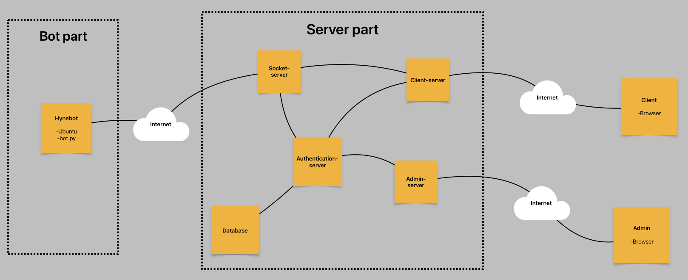

# Hynebot Control Center [Bot]

The idea behind this project is to allow and handle use of hynebots over the Internet. This repository contains all programs related to the bot. This bot part is developed to work on the Ubuntu computer in the hynebot.



## Table of Contents

- [How to install bot code?](#how-to-install-bot-part)
- [How to automatically start the bot script?](#how-to-automatically-start-the-bot-script)
- [File structure](#file-structure)

## How to install bot part?

### Clone

Clone the project:

```bash
git clone git@github.com:m1r0-h/hynebot-control-center-bot.git

cd hynebot-control-center-bot/
```

### Python and libaries

You need to have python installed and all nessesary libaries.

All necessary libaries:

- python-socketio[client]
- dotenv
- (os)
- (sys)
- (datetime)
- serial
- tmcl
- pymodbus

You can install the all necessary libraries with command (bot.py):

```bash
sudo pip3 install "python-socketio[client]" python-dotenv pyserial tmcl pymodbus
```

If you are only using a simpler bot program (simple_bot.py) with no motor control, you can only install the following libraries:

```bash
sudo pip3 install "python-socketio[client]" python-dotenv
```

### .env file

Make an .env file and add necessary variables:

```bash
nano .env
```

You need to add server address "SERVER_ADDRESS" and check token "SERVER_VERIFY_TOKEN" to the .env file (Use the ones you set in the websocket server's .env file). Bot login token "BOT_LOGIN_TOKEN" can be created in the admin page. Also, if you use a (bot.py) program where motors are controlled, you need to add the motor control ports.

You can also disable SSL verification for development purposes.

An example is below.

Example .env file:

```
# Server address and tokens
SERVER_ADDRESS = https://xxx.xxx.xxx.xxx:8083
BOT_LOGIN_TOKEN = create_code_on_admin_page
SERVER_VERIFY_TOKEN = verification_token_for_the_bot

# Ports (bot.py)
TRINAMIC_PORT = /dev/ttyACM3
MODBUS_PORT = /dev/ttyUSB0

# You can disable ssl verification (for development)
VERIFY_SSL = False
```

## How to automatically start the bot script?

You might also need to start the automatically when the bot starts.

Make service:

```bash
sudo nano /etc/systemd/system/hynebot.service
```

Example:

```bash
[Unit]
Description=Hynebot script
After=network-online.target
Wants=network-online.target

[Service]
User=Ubuntu
WorkingDirectory=/home/hynebot-control-center-bot
ExecStart=/home/hynebot-control-center-bot/env/bin/python3 /home/hynebot-control-center-bot/bot.py
Restart=always

[Install]
WantedBy=multi-user.target
```

You can use either "bot.py" or "simple_bot.py".

Enable service:

```bash
sudo systemctl enable hynebot.service
```

## File structure

```bash
hynebot-control-center-bot/
│
├── .env                    # Environment variables
│
├── bot.py                  # Bot script
│
├── simple_bot.py           # Bot script without motor control
│
├── README.md               # Documentation file (this file)
│
└── system_structure.png    # System structure picture
```
